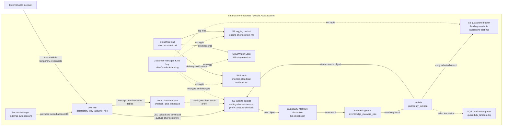

# Corporate Data Factory: Sherlock

This environment provides a secure landing bucket for data supplied by an external AWS account.

The data factory allows for:

- receiving data in an encrypted S3 landing bucket from an external aws account
- limiting the external account to its allocated S3 prefix
- allowing the user to catalogue the data with AWS Glue
- scanning new S3 objects for malware with GuardDuty Malware Protection
- moving selected scan results to a quarantine bucket
- encrypting data and supporting services with a customer-managed KMS key
- recording AWS management activity with CloudTrail

## Architecture



## Process

### 1. An external account is trusted

The account ID stored in the `external-aws-account` Secrets Manager secret is used to create the trust relationship for `datafactory_dev_assume_role`.

The external account does not receive permanent credentials. A principal in that account assumes the role and receives temporary credentials.

The role is restricted to:

- the `avature-sherlock` prefix in the landing bucket
- `GetObject`, `PutObject`, and `ListBucket` operations for that area
- the Sherlock KMS key for encryption and decryption
- the Sherlock Glue database and its tables

It does not grant access to the whole landing bucket or the quarantine bucket.

### 2. Data arrives in the landing bucket

The landing bucket is created with a prefix using aws reccomended naming convention, the final bucket name also includes the AWS account ID and region.

The bucket uses:

- SSE-KMS encryption customer managed key
- bucket-owner-enforced object ownership
- versioning
- public access protection from the shared S3 module
- no cross-region replication

The Glue database points at the `avature-sherlock` prefix. Avature can add glue tables for their data.

### 3. GuardDuty scans new objects

The GuardDuty Malware Protection plan protects the landing bucket. When a new object is created, GuardDuty scans it and writes the scan result back to the object as tags.

GuardDuty also publishes a scan result event to the default EventBridge bus.

The GuardDuty configuration is in [modules/guardduty-malware-scan/main.tf](modules/guardduty-malware-scan/main.tf).

### 4. EventBridge starts the quarantine workflow

The `eventbridge_malware_rule` rule listens for GuardDuty Malware Protection object scan results for the landing bucket.

It sends matching events to `guardduty_lambda`. The rule is defined in [modules/guardduty-eventbridge/main.tf](modules/guardduty-eventbridge/main.tf).

The current configuration matches these statuses:

```text
THREATS_FOUND
FAILED
ACCESS_DENIED
UNSUPPORTED
NO_THREATS_FOUND
```

### 5. Lambda quarantines selected objects

The Lambda reads the bucket, object key, and scan status from the EventBridge event.

For a status in `QUARANTINE_STATUSES`, it:

1. copies the object to the quarantine bucket using the KMS key
2. deletes the original object from the landing bucket
3. writes details to its CloudWatch log stream

If the Lambda invocation fails, the event is sent to the `guardduty_lambda-dlq` SQS dead-letter queue.

The function code is in [modules/guardduty-lambda/src/lambda.py](modules/guardduty-lambda/src/lambda.py).

> `NO_THREATS_FOUND` is currently included in `quarantine_statuses` for testing.

### 6. CloudTrail provides the audit trail

The `sherlock-cloudtrail` trail is configured as a multi-region trail and includes global service events.

It sends:

- CloudTrail log files to the encrypted logging S3 bucket
- event records to the `/aws/cloudtrail/sherlock-cloudtrail` CloudWatch log group
- log delivery notifications to the `sherlock-cloudtrail-notifications` SNS topic

The CloudWatch log group retains records for 365 days. The S3 logging bucket is versioned and uses the Sherlock KMS key.

This trail records AWS management activity by default. It does not currently enable S3 object-level data events, so it will not record every individual file upload, download, or deletion. That would require an `event_selector` or `advanced_event_selector`.

The configuration is in [modules/logging-bucket-cloudtrail/main.tf](modules/logging-bucket-cloudtrail/main.tf).


## Resource map

| Terraform module | AWS resources or purpose |
| --- | --- |
| `sherlock_kms_key` | Customer-managed KMS key and alias `sherlock-landing` |
| `sherlock_landing_bucket_mp` | Encrypted, versioned S3 landing bucket |
| `sherlock_quarantine_bucket` | Encrypted S3 quarantine bucket |
| `sherlock_logging_bucket_cloudtrail` | CloudTrail, logging S3 bucket, CloudWatch log group, SNS topic |
| `sherlock_glue_database` | Glue database for the landing prefix |
| `assume_iam_role` | Trusted external role and scoped S3, KMS, and Glue permissions |
| `data_factory_guardduty_scan` | GuardDuty Malware Protection plan |
| `data_factory_guardduty_eventbridge` | EventBridge rule and Lambda target |
| `data_factory_guardduty_lambda` | Quarantine Lambda and SQS dead-letter queue |


