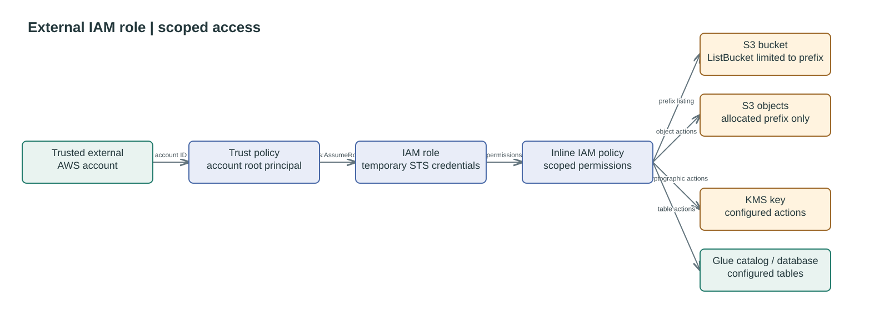

# Data Factory External IAM Role

Creates a role that principals in a trusted AWS account can assume using STS.
The role's inline policy grants access to objects under one S3 prefix, the
specified KMS key, and tables in a Glue database. Bucket listing is limited to
the prefix; object, KMS, and Glue actions are supplied by the caller.

The trust policy names the trusted account root, so that account controls which
of its principals can assume the role. Set `glue_table_name` to `"*"` only
when the external account must manage all tables in the database.

## Access flow




## Usage

```hcl
module "assume_iam_role" {
    source = "./modules/external-iam-role"

    role_name          = "datafactory_external_assume_role"
    trusted_account_id = data.aws_secretsmanager_secret_version.external_account_id.secret_string
    bucket_arn         = module.sherlock_landing_bucket_mp.bucket.arn
    s3_prefix          = "avature-sherlock"
    s3_object_actions  = ["s3:GetObject", "s3:PutObject"]

    kms_key_arn = module.sherlock_kms_key.key_arn
    kms_actions = ["kms:Decrypt", "kms:Encrypt", "kms:GenerateDataKey"]

    glue_catalog_arn  = local.glue_catalog_arn
    glue_database_arn = module.sherlock_glue_database.glue_database_arn
    glue_table_name   = "*"
    glue_actions      = ["glue:GetDatabase", "glue:GetTable", "glue:CreateTable"]

    tags = {
        Application = "data-factory-corporate"
    }
}
```

`s3:ListBucket` is granted separately by the module for the allocated prefix;
it is not an object action. The output `role_arn` can be given to the external
account for its `sts:AssumeRole` call.

<!--BEGIN_TF_DOCS-->
## Requirements

| Name | Version |
| ---- | ------- |
| <a name="requirement_terraform"></a> [terraform](#requirement\_terraform) | >= 1.7.0 |
| <a name="requirement_aws"></a> [aws](#requirement\_aws) | >= 6.0, < 7.0 |

## Providers

| Name | Version |
| ---- | ------- |
| <a name="provider_aws"></a> [aws](#provider\_aws) | 6.58.0 |

## Modules

No modules.

## Resources

| Name | Type |
| ---- | ---- |
| [aws_iam_role.this](https://registry.terraform.io/providers/hashicorp/aws/latest/docs/resources/iam_role) | resource |
| [aws_iam_role_policy.this](https://registry.terraform.io/providers/hashicorp/aws/latest/docs/resources/iam_role_policy) | resource |
| [aws_caller_identity.current](https://registry.terraform.io/providers/hashicorp/aws/latest/docs/data-sources/caller_identity) | data source |
| [aws_region.current](https://registry.terraform.io/providers/hashicorp/aws/latest/docs/data-sources/region) | data source |

## Inputs

| Name | Description | Type | Default | Required |
| ---- | ----------- | ---- | ------- | :------: |
| <a name="input_bucket_arn"></a> [bucket\_arn](#input\_bucket\_arn) | ARN of the S3 bucket containing the allocated prefix. | `string` | n/a | yes |
| <a name="input_glue_actions"></a> [glue\_actions](#input\_glue\_actions) | Glue table actions allowed within the allocated database. | `list(string)` | `[]` | no |
| <a name="input_glue_catalog_arn"></a> [glue\_catalog\_arn](#input\_glue\_catalog\_arn) | ARN of the Glue catalog. | `string` | n/a | yes |
| <a name="input_glue_database_arn"></a> [glue\_database\_arn](#input\_glue\_database\_arn) | ARN of the Glue database allocated to the external client. | `string` | n/a | yes |
| <a name="input_glue_table_name"></a> [glue\_table\_name](#input\_glue\_table\_name) | Glue table name, either for a specific table or all tables in the database. | `string` | n/a | yes |
| <a name="input_kms_actions"></a> [kms\_actions](#input\_kms\_actions) | KMS cryptographic actions allowed through Amazon S3. | `list(string)` | `[]` | no |
| <a name="input_kms_key_arn"></a> [kms\_key\_arn](#input\_kms\_key\_arn) | ARN of the KMS key used to encrypt objects in the S3 bucket. | `string` | n/a | yes |
| <a name="input_max_session_duration"></a> [max\_session\_duration](#input\_max\_session\_duration) | Maximum session duration for the IAM role, in seconds. | `number` | `3600` | no |
| <a name="input_role_name"></a> [role\_name](#input\_role\_name) | Name of the IAM role. | `string` | n/a | yes |
| <a name="input_s3_object_actions"></a> [s3\_object\_actions](#input\_s3\_object\_actions) | S3 object actions allowed within the allocated prefix. | `list(string)` | `[]` | no |
| <a name="input_s3_prefix"></a> [s3\_prefix](#input\_s3\_prefix) | S3 key prefix allocated to the external client. | `string` | `""` | no |
| <a name="input_tags"></a> [tags](#input\_tags) | Tags to apply to created resources. | `map(string)` | `{}` | no |
| <a name="input_trusted_account_id"></a> [trusted\_account\_id](#input\_trusted\_account\_id) | AWS account ID allowed to assume the role. | `string` | n/a | yes |

## Outputs

| Name | Description |
| ---- | ----------- |
| <a name="output_role_arn"></a> [role\_arn](#output\_role\_arn) | ARN of the IAM role. |
| <a name="output_role_name"></a> [role\_name](#output\_role\_name) | Name of the IAM role. |
<!--END_TF_DOCS-->