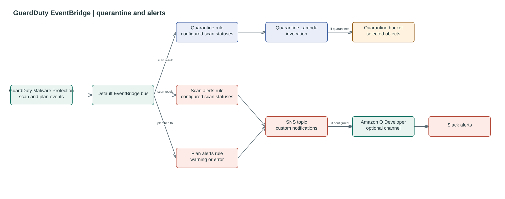

# GuardDuty EventBridge

Routes GuardDuty Malware Protection for S3 events for the configured buckets to
a quarantine Lambda and an SNS alerts topic. Object scan results matching
`scan_result_statuses` trigger both targets; protection plan warnings and errors
trigger SNS alerts independently. The Lambda decides which matched objects to
quarantine using its own configured statuses.

To receive alerts in Slack, authorise the Slack workspace in Amazon Q Developer
in chat applications and connect a channel to the `scan_alerts_topic_arn` output
after deployment. The people root optionally configures the Slack channel;
this module only provides the SNS topic. Include
`NO_THREATS_FOUND` in `scan_result_statuses` only if clean scan notifications
are required.

## Event flow




## Usage

```hcl
module "data_factory_guardduty_eventbridge" {
    source = "./modules/guardduty-eventbridge"

    name                 = "eventbridge-malware-rule"
    bucket_names         = [module.sherlock_landing_bucket_mp.bucket.bucket]
    scan_result_statuses = ["THREATS_FOUND", "FAILED", "ACCESS_DENIED", "UNSUPPORTED"]
    target_lambda_name   = module.data_factory_guardduty_lambda.name
    target_lambda_arn    = module.data_factory_guardduty_lambda.arn

    tags = {
        Project = "DataFactory"
    }
}
```

<!--BEGIN_TF_DOCS-->
## Requirements

| Name | Version |
| ---- | ------- |
| <a name="requirement_terraform"></a> [terraform](#requirement\_terraform) | >= 1.7.0 |
| <a name="requirement_aws"></a> [aws](#requirement\_aws) | >= 6.0, < 7.0 |

## Providers

| Name | Version |
| ---- | ------- |
| <a name="provider_aws"></a> [aws](#provider\_aws) | 6.61.0 |

## Modules

No modules.

## Resources

| Name | Type |
| ---- | ---- |
| [aws_cloudwatch_event_rule.guardduty_quarantine](https://registry.terraform.io/providers/hashicorp/aws/latest/docs/resources/cloudwatch_event_rule) | resource |
| [aws_cloudwatch_event_rule.plan_alerts](https://registry.terraform.io/providers/hashicorp/aws/latest/docs/resources/cloudwatch_event_rule) | resource |
| [aws_cloudwatch_event_rule.scan_alerts](https://registry.terraform.io/providers/hashicorp/aws/latest/docs/resources/cloudwatch_event_rule) | resource |
| [aws_cloudwatch_event_target.guardduty_quarantine_lambda](https://registry.terraform.io/providers/hashicorp/aws/latest/docs/resources/cloudwatch_event_target) | resource |
| [aws_cloudwatch_event_target.plan_alerts](https://registry.terraform.io/providers/hashicorp/aws/latest/docs/resources/cloudwatch_event_target) | resource |
| [aws_cloudwatch_event_target.scan_alerts](https://registry.terraform.io/providers/hashicorp/aws/latest/docs/resources/cloudwatch_event_target) | resource |
| [aws_lambda_permission.allow_eventbridge_quarantine](https://registry.terraform.io/providers/hashicorp/aws/latest/docs/resources/lambda_permission) | resource |
| [aws_sns_topic.scan_alerts](https://registry.terraform.io/providers/hashicorp/aws/latest/docs/resources/sns_topic) | resource |
| [aws_sns_topic_policy.scan_alerts](https://registry.terraform.io/providers/hashicorp/aws/latest/docs/resources/sns_topic_policy) | resource |
| [aws_caller_identity.current](https://registry.terraform.io/providers/hashicorp/aws/latest/docs/data-sources/caller_identity) | data source |
| [aws_iam_policy_document.scan_alerts](https://registry.terraform.io/providers/hashicorp/aws/latest/docs/data-sources/iam_policy_document) | data source |
| [aws_region.current](https://registry.terraform.io/providers/hashicorp/aws/latest/docs/data-sources/region) | data source |

## Inputs

| Name | Description | Type | Default | Required |
| ---- | ----------- | ---- | ------- | :------: |
| <a name="input_bucket_names"></a> [bucket\_names](#input\_bucket\_names) | Names of the S3 buckets to apply rule to. | `list(string)` | `[]` | no |
| <a name="input_name"></a> [name](#input\_name) | Name of the EventBridge rule. | `string` | `"eventbridge-guardduty-quarantine"` | no |
| <a name="input_scan_result_statuses"></a> [scan\_result\_statuses](#input\_scan\_result\_statuses) | List of scan result statuses to match in the EventBridge rule. | `list(string)` | <pre>[<br/>  "THREATS_FOUND",<br/>  "FAILED",<br/>  "ACCESS_DENIED"<br/>]</pre> | no |
| <a name="input_tags"></a> [tags](#input\_tags) | Tags to apply to created resources. | `map(string)` | `{}` | no |
| <a name="input_target_lambda_arn"></a> [target\_lambda\_arn](#input\_target\_lambda\_arn) | ARN of the target Lambda function. | `string` | n/a | yes |
| <a name="input_target_lambda_name"></a> [target\_lambda\_name](#input\_target\_lambda\_name) | Name of the target Lambda function. | `string` | `"quarantine-lambda"` | no |

## Outputs

| Name | Description |
| ---- | ----------- |
| <a name="output_rule_arn"></a> [rule\_arn](#output\_rule\_arn) | ARN of the EventBridge rule. |
| <a name="output_scan_alerts_topic_arn"></a> [scan\_alerts\_topic\_arn](#output\_scan\_alerts\_topic\_arn) | SNS topic to connect to an Amazon Q Developer in chat applications Slack channel for GuardDuty alerts. |
<!--END_TF_DOCS-->