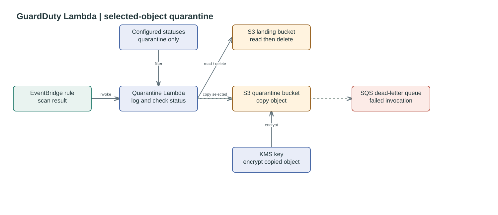

# GuardDuty Lambda

Creates the Lambda invoked by the GuardDuty EventBridge rule. It logs the scan
result and copies objects with statuses in `quarantine_statuses` to the quarantine
bucket before deleting the source object. An SQS dead-letter queue captures
failed asynchronous invocations.

## Quarantine flow




## Usage

```hcl
module "data_factory_guardduty_lambda" {
    source = "./modules/guardduty-lambda"

    name                 = "guardduty_lambda"
    eventbridge_rule_arn = module.data_factory_guardduty_eventbridge.rule_arn
    quarantine_statuses  = ["THREATS_FOUND", "FAILED", "ACCESS_DENIED", "UNSUPPORTED"]

    lambda_kms_key_arn      = module.sherlock_kms_key.key_arn
    quarantine_bucket_name = module.sherlock_quarantine_bucket.bucket.bucket
    quarantine_bucket_arn  = module.sherlock_quarantine_bucket.bucket.arn
    quarantine_kms_key_arn = module.sherlock_quarantine_kms_key.key_arn
    s3_bucket_name         = module.sherlock_landing_bucket_mp.bucket.bucket
    s3_bucket_arn          = module.sherlock_landing_bucket_mp.bucket.arn
    s3_bucket_kms_key_arn  = module.sherlock_kms_key.key_arn

    tags = {
        Project = "DataFactory"
    }
}
```

<!--BEGIN_TF_DOCS-->
## Requirements

| Name | Version |
| ---- | ------- |
| <a name="requirement_terraform"></a> [terraform](#requirement\_terraform) | >= 1.7.0 |
| <a name="requirement_archive"></a> [archive](#requirement\_archive) | ~> 2.4 |
| <a name="requirement_aws"></a> [aws](#requirement\_aws) | >= 6.0, < 7.0 |

## Providers

| Name | Version |
| ---- | ------- |
| <a name="provider_archive"></a> [archive](#provider\_archive) | 2.8.0 |
| <a name="provider_aws"></a> [aws](#provider\_aws) | 6.54.0 |

## Modules

No modules.

## Resources

| Name | Type |
| ---- | ---- |
| [aws_iam_role.quarantine_lambda](https://registry.terraform.io/providers/hashicorp/aws/latest/docs/resources/iam_role) | resource |
| [aws_iam_role_policy.quarantine_lambda](https://registry.terraform.io/providers/hashicorp/aws/latest/docs/resources/iam_role_policy) | resource |
| [aws_iam_role_policy_attachment.logs](https://registry.terraform.io/providers/hashicorp/aws/latest/docs/resources/iam_role_policy_attachment) | resource |
| [aws_lambda_function.quarantine](https://registry.terraform.io/providers/hashicorp/aws/latest/docs/resources/lambda_function) | resource |
| [aws_sqs_queue.quarantine_dlq](https://registry.terraform.io/providers/hashicorp/aws/latest/docs/resources/sqs_queue) | resource |
| [archive_file.quarantine_lambda](https://registry.terraform.io/providers/hashicorp/archive/latest/docs/data-sources/file) | data source |
| [aws_caller_identity.current](https://registry.terraform.io/providers/hashicorp/aws/latest/docs/data-sources/caller_identity) | data source |
| [aws_region.current](https://registry.terraform.io/providers/hashicorp/aws/latest/docs/data-sources/region) | data source |

## Inputs

| Name | Description | Type | Default | Required |
| ---- | ----------- | ---- | ------- | :------: |
| <a name="input_eventbridge_rule_arn"></a> [eventbridge\_rule\_arn](#input\_eventbridge\_rule\_arn) | ARN of the EventBridge rule that triggers the Lambda function. | `string` | n/a | yes |
| <a name="input_lambda_handler"></a> [lambda\_handler](#input\_lambda\_handler) | Handler for the Lambda function. | `string` | `"lambda.lambda_handler"` | no |
| <a name="input_lambda_kms_key_arn"></a> [lambda\_kms\_key\_arn](#input\_lambda\_kms\_key\_arn) | KMS key ARN used to encrypt Lambda environment variables. | `string` | n/a | yes |
| <a name="input_memory_size"></a> [memory\_size](#input\_memory\_size) | Memory size for the Lambda function. | `number` | `256` | no |
| <a name="input_name"></a> [name](#input\_name) | Name of the lambda function. | `string` | `"quarantine-lambda"` | no |
| <a name="input_quarantine_bucket_arn"></a> [quarantine\_bucket\_arn](#input\_quarantine\_bucket\_arn) | ARN of the S3 bucket to move failed scan objects to. | `string` | n/a | yes |
| <a name="input_quarantine_bucket_name"></a> [quarantine\_bucket\_name](#input\_quarantine\_bucket\_name) | Name of the S3 bucket to move failed scan objects to. | `string` | n/a | yes |
| <a name="input_quarantine_kms_key_arn"></a> [quarantine\_kms\_key\_arn](#input\_quarantine\_kms\_key\_arn) | ARN of the KMS key used to encrypt objects in the quarantine S3 bucket. | `string` | n/a | yes |
| <a name="input_quarantine_statuses"></a> [quarantine\_statuses](#input\_quarantine\_statuses) | List of scan result statuses that should trigger quarantine. | `list(string)` | <pre>[<br/>  "THREATS_FOUND",<br/>  "FAILED",<br/>  "ACCESS_DENIED",<br/>  "UNSUPPORTED"<br/>]</pre> | no |
| <a name="input_reserved_concurrent_executions"></a> [reserved\_concurrent\_executions](#input\_reserved\_concurrent\_executions) | Reserved concurrent executions for the Lambda function. | `number` | `5` | no |
| <a name="input_runtime"></a> [runtime](#input\_runtime) | Runtime for the Lambda function. | `string` | `"python3.12"` | no |
| <a name="input_s3_bucket_arn"></a> [s3\_bucket\_arn](#input\_s3\_bucket\_arn) | ARN of the S3 bucket to read objects from. | `string` | n/a | yes |
| <a name="input_s3_bucket_kms_key_arn"></a> [s3\_bucket\_kms\_key\_arn](#input\_s3\_bucket\_kms\_key\_arn) | ARN of the KMS key used to encrypt objects in the landing S3 bucket. | `string` | n/a | yes |
| <a name="input_s3_bucket_name"></a> [s3\_bucket\_name](#input\_s3\_bucket\_name) | Name of the S3 bucket to read objects from. | `string` | n/a | yes |
| <a name="input_tags"></a> [tags](#input\_tags) | Tags to apply to created resources. | `map(string)` | `{}` | no |
| <a name="input_timeout"></a> [timeout](#input\_timeout) | Timeout for the Lambda function. | `number` | `60` | no |

## Outputs

| Name | Description |
| ---- | ----------- |
| <a name="output_arn"></a> [arn](#output\_arn) | ARN of the Lambda function. |
| <a name="output_name"></a> [name](#output\_name) | Name of the Lambda function. |
<!--END_TF_DOCS-->