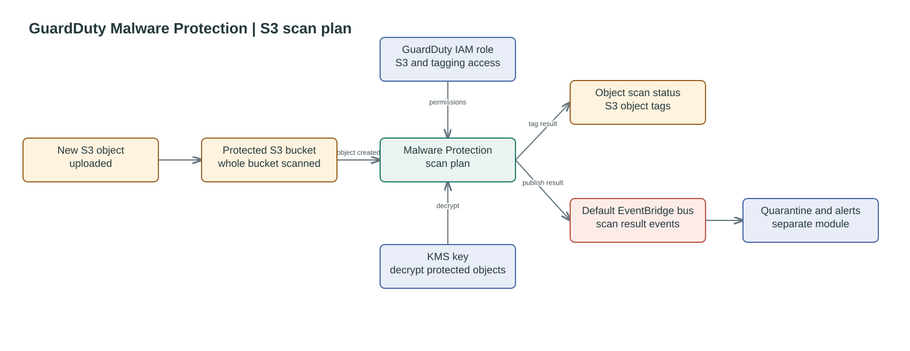

# Data Factory GuardDuty Malware Scan

Creates a GuardDuty Malware Protection plan for the S3 bucket and the IAM role
GuardDuty needs to read, decrypt, and tag objects. GuardDuty publishes scan
results to the default EventBridge bus; quarantine and notifications are managed
by the separate GuardDuty EventBridge module. The plan currently scans the
whole bucket.

## Scan flow




## Usage

```hcl
module "data_factory_guardduty_scan" {
    source = "./modules/guardduty-malware-scan"

    bucket_name = module.sherlock_landing_bucket_mp.bucket.bucket
    bucket_arn  = module.sherlock_landing_bucket_mp.bucket.arn
    kms_key_arn = module.sherlock_kms_key.key_arn

    tags = {
        Project = "DataFactory"
    }
}
```

<!--BEGIN_TF_DOCS-->
## Requirements

| Name | Version |
| ---- | ------- |
| <a name="requirement_terraform"></a> [terraform](#requirement\_terraform) | >= 1.7.0 |
| <a name="requirement_aws"></a> [aws](#requirement\_aws) | >= 6.0, < 7.0 |

## Providers

| Name | Version |
| ---- | ------- |
| <a name="provider_aws"></a> [aws](#provider\_aws) | 6.60.0 |

## Modules

No modules.

## Resources

| Name | Type |
| ---- | ---- |
| [aws_guardduty_malware_protection_plan.this](https://registry.terraform.io/providers/hashicorp/aws/latest/docs/resources/guardduty_malware_protection_plan) | resource |
| [aws_iam_role.guardduty_malware_protection](https://registry.terraform.io/providers/hashicorp/aws/latest/docs/resources/iam_role) | resource |
| [aws_iam_role_policy.guardduty_malware_protection](https://registry.terraform.io/providers/hashicorp/aws/latest/docs/resources/iam_role_policy) | resource |
| [aws_caller_identity.current](https://registry.terraform.io/providers/hashicorp/aws/latest/docs/data-sources/caller_identity) | data source |
| [aws_iam_policy_document.guardduty_malware_protection](https://registry.terraform.io/providers/hashicorp/aws/latest/docs/data-sources/iam_policy_document) | data source |
| [aws_region.current](https://registry.terraform.io/providers/hashicorp/aws/latest/docs/data-sources/region) | data source |

## Inputs

| Name | Description | Type | Default | Required |
| ---- | ----------- | ---- | ------- | :------: |
| <a name="input_bucket_arn"></a> [bucket\_arn](#input\_bucket\_arn) | ARN of the S3 bucket to protect. | `string` | n/a | yes |
| <a name="input_bucket_name"></a> [bucket\_name](#input\_bucket\_name) | Name of the S3 bucket to protect. | `string` | n/a | yes |
| <a name="input_kms_key_arn"></a> [kms\_key\_arn](#input\_kms\_key\_arn) | KMS key ARN that GuardDuty may use to decrypt protected S3 objects | `string` | n/a | yes |
| <a name="input_tags"></a> [tags](#input\_tags) | Tags to apply to created resources. | `map(string)` | `{}` | no |

## Outputs

| Name | Description |
| ---- | ----------- |
| <a name="output_guardduty_malware_protection_plan_id"></a> [guardduty\_malware\_protection\_plan\_id](#output\_guardduty\_malware\_protection\_plan\_id) | ID of the GuardDuty Malware Protection plan. |
| <a name="output_guardduty_malware_protection_plan_role_arn"></a> [guardduty\_malware\_protection\_plan\_role\_arn](#output\_guardduty\_malware\_protection\_plan\_role\_arn) | IAM role ARN used by GuardDuty Malware Protection. |
| <a name="output_guardduty_malware_protection_plan_status"></a> [guardduty\_malware\_protection\_plan\_status](#output\_guardduty\_malware\_protection\_plan\_status) | Status of the GuardDuty Malware Protection plan. |
<!--END_TF_DOCS-->