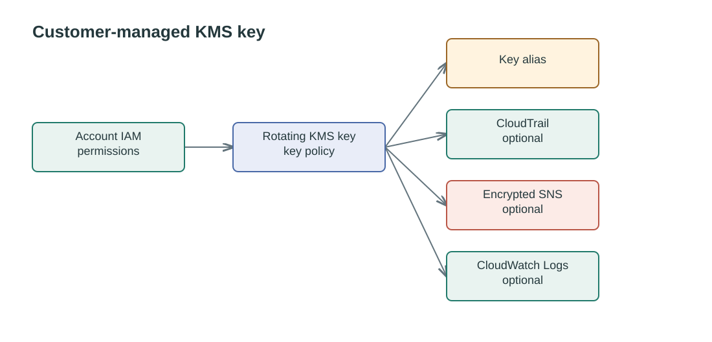

# KMS Key

Creates a customer-managed KMS key with automatic rotation and an alias. The
key policy permits IAM permissions in the owning account. Set `cloudtrail_name`
to grant that trail access to encrypt logs and publish to an encrypted SNS
topic. Set `enable_cloudwatch_logs` to allow regional CloudWatch Logs groups
in the account to use the key. Both service grants are optional.

## Key access




## Usage

```hcl
module "sherlock_logging_kms_key" {
  source = "./modules/kms-key"

  alias                  = "sherlock-logging"
  cloudtrail_name        = "sherlock-cloudtrail"
  enable_cloudwatch_logs = true

  tags = {
    Project = "DataFactory"
  }
}
```

Use the `key_arn` output for services that encrypt data with this key; `alias_name`
returns the full name with the `alias/` prefix.

<!-- BEGIN_TF_DOCS -->
## Requirements

| Name | Version |
| ---- | ------- |
| <a name="requirement_terraform"></a> [terraform](#requirement\_terraform) | >= 1.7.0 |
| <a name="requirement_aws"></a> [aws](#requirement\_aws) | >= 6.0, < 7.0 |

## Providers

| Name | Version |
| ---- | ------- |
| <a name="provider_aws"></a> [aws](#provider\_aws) | >= 6.0, < 7.0 |

## Modules

No modules.

## Resources

| Name | Type |
| ---- | ---- |
| [aws_kms_alias.this](https://registry.terraform.io/providers/hashicorp/aws/latest/docs/resources/kms_alias) | resource |
| [aws_kms_key.this](https://registry.terraform.io/providers/hashicorp/aws/latest/docs/resources/kms_key) | resource |
| [aws_caller_identity.current](https://registry.terraform.io/providers/hashicorp/aws/latest/docs/data-sources/caller_identity) | data source |
| [aws_iam_policy_document.key](https://registry.terraform.io/providers/hashicorp/aws/latest/docs/data-sources/iam_policy_document) | data source |
| [aws_region.current](https://registry.terraform.io/providers/hashicorp/aws/latest/docs/data-sources/region) | data source |

## Inputs

| Name | Description | Type | Default | Required |
| ---- | ----------- | ---- | ------- | :------: |
| <a name="input_alias"></a> [alias](#input\_alias) | Alias name for the KMS key, without the 'alias/' prefix. | `string` | n/a | yes |
| <a name="input_cloudtrail_name"></a> [cloudtrail\_name](#input\_cloudtrail\_name) | Name of the CloudTrail trail permitted to use this key. Leave null to omit the CloudTrail key policy statements. | `string` | `null` | no |
| <a name="input_deletion_window_in_days"></a> [deletion\_window\_in\_days](#input\_deletion\_window\_in\_days) | Waiting period before the key is deleted. | `number` | `30` | no |
| <a name="input_enable_cloudwatch_logs"></a> [enable\_cloudwatch\_logs](#input\_enable\_cloudwatch\_logs) | Whether to allow CloudWatch Logs to use this key for log group encryption. | `bool` | `false` | no |
| <a name="input_rotation_period_in_days"></a> [rotation\_period\_in\_days](#input\_rotation\_period\_in\_days) | Number of days between automatic key rotations. | `number` | `365` | no |
| <a name="input_tags"></a> [tags](#input\_tags) | Tags to apply to created resources. | `map(string)` | `{}` | no |

## Outputs

| Name | Description |
| ---- | ----------- |
| <a name="output_alias_name"></a> [alias\_name](#output\_alias\_name) | Alias of the KMS key. |
| <a name="output_key_arn"></a> [key\_arn](#output\_key\_arn) | ARN of the KMS key. |
| <a name="output_key_id"></a> [key\_id](#output\_key\_id) | ID of the KMS key. |
<!-- END_TF_DOCS -->