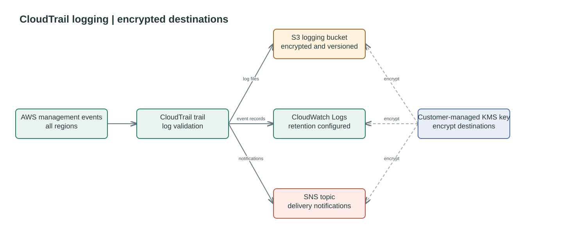

# CloudTrail Logging

Creates a multi-region CloudTrail trail with an encrypted, versioned S3 log
bucket, an encrypted CloudWatch Logs group, and an encrypted SNS topic for
CloudTrail delivery notifications. The supplied KMS key must allow CloudTrail
and CloudWatch Logs to use it. S3 object-level data events are not enabled by this module.

## Logging flow




## Usage

```hcl
module "corp_people_logging_bucket" {
  source = "./modules/logging-bucket-cloudtrail"

  bucket_prefix                    = "logging-sherlock-test-mp"
  cloudtrail_name                  = "sherlock-cloudtrail"
  kms_key_arn                      = module.sherlock_logging_kms_key.key_arn
  cloudwatch_log_retention_in_days = 365

  tags = {
    Project = "DataFactory"
  }
}
```

The `log_bucket_name` and `cloudtrail_arn` outputs identify the bucket and trail.

<!-- BEGIN_TF_DOCS -->
## Requirements

| Name | Version |
| ---- | ------- |
| <a name="requirement_terraform"></a> [terraform](#requirement\_terraform) | >= 1.7.0 |
| <a name="requirement_aws"></a> [aws](#requirement\_aws) | >= 6.0, < 7.0 |

## Providers

| Name | Version |
| ---- | ------- |
| <a name="provider_aws"></a> [aws](#provider\_aws) | >= 6.0, < 7.0 |

## Modules

| Name | Source | Version |
| ---- | ------ | ------- |
| <a name="module_log_bucket"></a> [log\_bucket](#module\_log\_bucket) | github.com/ministryofjustice/modernisation-platform-terraform-s3-bucket | 66bd5c6aa0d0396442f0d4a63642029ff38d2a8a |

## Resources

| Name | Type |
| ---- | ---- |
| [aws_cloudtrail.sherlock](https://registry.terraform.io/providers/hashicorp/aws/latest/docs/resources/cloudtrail) | resource |
| [aws_cloudwatch_log_group.cloudtrail](https://registry.terraform.io/providers/hashicorp/aws/latest/docs/resources/cloudwatch_log_group) | resource |
| [aws_iam_role.cloudtrail_logs](https://registry.terraform.io/providers/hashicorp/aws/latest/docs/resources/iam_role) | resource |
| [aws_iam_role_policy.cloudtrail_logs](https://registry.terraform.io/providers/hashicorp/aws/latest/docs/resources/iam_role_policy) | resource |
| [aws_sns_topic.cloudtrail](https://registry.terraform.io/providers/hashicorp/aws/latest/docs/resources/sns_topic) | resource |
| [aws_sns_topic_policy.cloudtrail](https://registry.terraform.io/providers/hashicorp/aws/latest/docs/resources/sns_topic_policy) | resource |
| [aws_caller_identity.current](https://registry.terraform.io/providers/hashicorp/aws/latest/docs/data-sources/caller_identity) | data source |
| [aws_iam_policy_document.cloudtrail_assume_role](https://registry.terraform.io/providers/hashicorp/aws/latest/docs/data-sources/iam_policy_document) | data source |
| [aws_iam_policy_document.cloudtrail_bucket](https://registry.terraform.io/providers/hashicorp/aws/latest/docs/data-sources/iam_policy_document) | data source |
| [aws_iam_policy_document.cloudtrail_cloudwatch_logs](https://registry.terraform.io/providers/hashicorp/aws/latest/docs/data-sources/iam_policy_document) | data source |
| [aws_iam_policy_document.cloudtrail_sns_publish](https://registry.terraform.io/providers/hashicorp/aws/latest/docs/data-sources/iam_policy_document) | data source |
| [aws_region.current](https://registry.terraform.io/providers/hashicorp/aws/latest/docs/data-sources/region) | data source |

## Inputs

| Name | Description | Type | Default | Required |
| ---- | ----------- | ---- | ------- | :------: |
| <a name="input_bucket_prefix"></a> [bucket\_prefix](#input\_bucket\_prefix) | Prefix for the logging bucket. | `string` | n/a | yes |
| <a name="input_cloudtrail_name"></a> [cloudtrail\_name](#input\_cloudtrail\_name) | Name of the CloudTrail trail. | `string` | n/a | yes |
| <a name="input_cloudwatch_log_retention_in_days"></a> [cloudwatch\_log\_retention\_in\_days](#input\_cloudwatch\_log\_retention\_in\_days) | Number of days to retain CloudWatch logs. | `number` | `365` | no |
| <a name="input_kms_key_arn"></a> [kms\_key\_arn](#input\_kms\_key\_arn) | ARN of the KMS key used for the logging bucket and CloudTrail encryption. | `string` | n/a | yes |
| <a name="input_tags"></a> [tags](#input\_tags) | Tags to apply to created resources. | `map(string)` | `{}` | no |

## Outputs

| Name | Description |
| ---- | ----------- |
| <a name="output_cloudtrail_arn"></a> [cloudtrail\_arn](#output\_cloudtrail\_arn) | The ARN of the CloudTrail. |
| <a name="output_log_bucket_name"></a> [log\_bucket\_name](#output\_log\_bucket\_name) | The name of the central log bucket. |
<!-- END_TF_DOCS -->