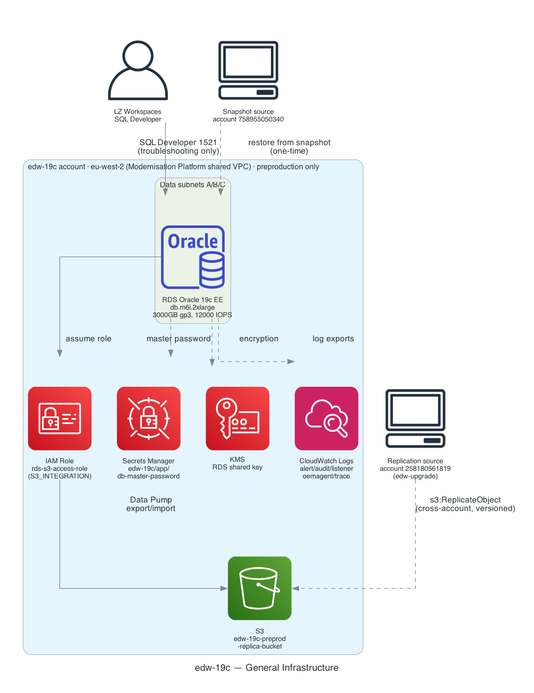

# 1. General Infrastructure

edw-19c is a single RDS Oracle instance in the shared Modernisation Platform VPC — there
is no application compute tier. The instance was provisioned by restoring a snapshot
taken in a separate migration account, and it replicates Data Pump export objects to S3
for a separate downstream account to consume.

## Key facts

| | |
|---|---|
| **VPC** | Shared Modernisation Platform VPC, data subnets A/B/C |
| **RDS** | Oracle 19c Enterprise Edition, `db.m6i.2xlarge`, BYOL |
| **Storage** | 3000GB gp3, 4000GB max autoscaling, 12000 provisioned IOPS, 500 MiB/s throughput |
| **Provisioning** | Restored from `snapshot_identifier` in account `758955050340` (`before-db-name-change-06-march-2026`) |
| **Security group** | Only ingress rule is SQL Developer (1521) from the LZ Workspaces management CIDR — the OAS↔EDW cross-app rules exist in Terraform but are commented out |
| **S3 integration** | `S3_INTEGRATION` RDS option + `rds-s3-access-role` IAM role, scoped to `edw-19c-preprod-replica-bucket`, for Data Pump export/import |
| **Cross-account replication** | The replica bucket accepts `s3:ReplicateObject/ReplicateDelete/ReplicateTags` from role `edw-upgrade-edw-19c-preproduction-replication` in account `258180561819` |
| **Secrets** | Master password in Secrets Manager (`edw-19c/app/db-master-password`), persists across `terraform apply` via `ignore_changes` |
| **Monitoring** | Performance Insights enabled (465-day retention); CloudWatch Logs exports for alert/audit/listener/oemagent/trace |
| **Environments** | `preproduction` only — `development`/`production` blocks in `application_variables.json` are empty placeholders |

[← Back to index](README.md) · [Next: Data Flow →](02-data-flow.md)
