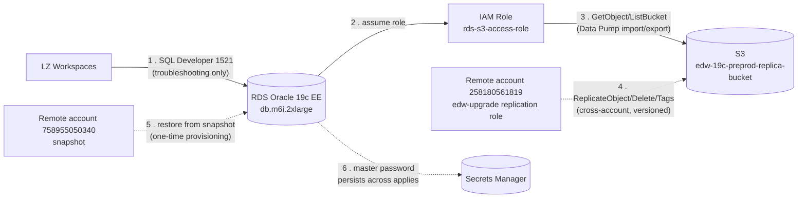

# 2. Data Flow

Database access, Data Pump export/import via S3, cross-account S3 replication, and the
one-time snapshot restore that provisioned the instance.

## Key facts

| | |
|---|---|
| **No application tier** | Unlike `oas`, this is a database-only workload — step 1 is a direct, troubleshooting-only path, not a production integration |
| **Data Pump path** | RDS's `S3_INTEGRATION` option assumes `rds-s3-access-role` to read/write the replica bucket for export/import |
| **Cross-account replication** | One-directional: account `258180561819` (the `edw-upgrade` migration project) replicates objects **into** the bucket; edw-19c does not write to any bucket it doesn't own |
| **Provisioning** | The instance was created once from a snapshot in account `758955050340` — `terraform apply` ignores changes to `snapshot_identifier` afterwards, so this never re-runs |
| **Secrets** | Master password generated once, stored in Secrets Manager, `ignore_changes` prevents accidental regeneration |

[← General Infrastructure](01-general-infrastructure.md) · [Back to index](README.md)
