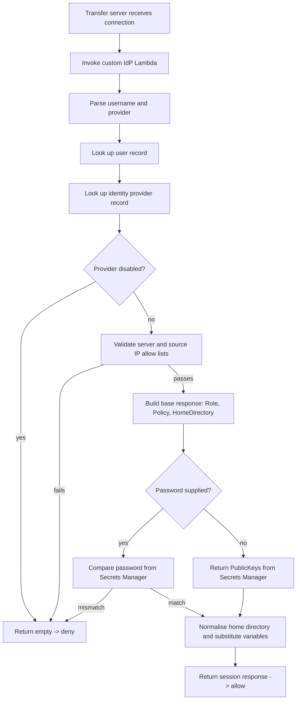

# Custom Identity Provider

This document describes the operation and function of the custom identity provider (IdP) that authenticates and authorises users of the Integration Hub managed file transfer proof of concept.

It is written for a technically literate audience: engineers operating the service, reviewers, and anyone integrating a new partner. It complements the [service runbook](../README.md) and follows Ministry of Justice [technical guidance](https://developer-portal.service.justice.gov.uk/docs/ministry-of-justice-technical-guidance/).

> **Proof of concept.** This identity provider is deliberately small and is intended to prove the pattern. Several defaults (open IPv4 allow lists, manually populated secrets, a single seeded user) are not production-ready and are called out in [Limitations and caveats](#limitations-and-caveats).

## Contents

- [Why a custom identity provider](#why-a-custom-identity-provider)
- [Data model](#data-model)
- [Authentication and authorisation flow](#authentication-and-authorisation-flow)
- [Username and provider selection](#username-and-provider-selection)
- [Credential validation](#credential-validation)
- [Authorisation context](#authorisation-context)
- [Building the Transfer response](#building-the-transfer-response)
- [Managing users](#managing-users)
- [Security considerations](#security-considerations)
- [Observability](#observability)
- [Limitations and caveats](#limitations-and-caveats)
- [References](#references)

## Why a custom identity provider

[AWS Transfer Family](https://docs.aws.amazon.com/transfer/latest/userguide/what-is-aws-transfer-family.html) supports several identity provider types: a service-managed user store, AWS Directory Service, AWS IAM Identity Center, and a *custom* provider. A custom provider hands every authentication request to either an Amazon API Gateway endpoint or, as here, an AWS Lambda function. The Lambda decides whether the connection is allowed and, if so, returns the IAM role, scope-down policy and home directory the session should use.

We use a custom Lambda provider because it lets us:

- Hold user records and credentials in our own AWS account, under our own KMS keys.
- Apply per-user authorisation (home directory, IAM scope-down policy, source-IP allow lists) without standing up a directory service.
- Support both password and SSH public key authentication for SFTP, and password authentication for FTPS.
- Evolve towards multiple back-end providers (for example LDAP or an external IdP) behind a single, stable interface.

The Lambda is derived from the AWS open-source [Toolkit for AWS Transfer Family — custom IdP solution](https://github.com/aws-samples/toolkit-for-aws-transfer-family/tree/main/solutions/custom-idp), so its DynamoDB record shape and Secrets Manager conventions match that project's documentation.

The Transfer server is wired to the Lambda in [`transfer-server.tf`](../transfer-server.tf):

```hcl
identity_provider_type = "AWS_LAMBDA"
function               = module.lambda_custom_idp.lambda_function_arn
```

The secret prefix (`transfer/`) and the user name delimiter (`@@`) are set from `local.custom_idp_configuration` (see [`locals.tf`](../locals.tf) and `application_variables.json`); the prefix is stored on the identity provider record so different providers can use different prefixes.

## Data model

Authentication state is split across three stores.

### Users table

Hash key `user`, range key `identity_provider_key`. Each item describes one principal and how to authorise their session.

| Attribute | Type | Notes |
| --- | --- | --- |
| `user` | String | Login name (lower-cased on lookup) |
| `identity_provider_key` | String | The provider this record authenticates against (for example `secrets`) |
| `idp_username` | String (optional) | Override used when looking up the credential, if it differs from `user` |
| `ipv4_allow_list` | String set (optional) | CIDR ranges permitted for this user |
| `server_id_allow_list` | String set (optional) | Transfer server IDs this user may use |
| `config` | Map | Session attributes: `Role`, `Policy`, `HomeDirectoryType`, `HomeDirectoryDetails`/`HomeDirectory`, `PosixProfile`, `PublicKeys` |

A record with `user = "$default$"` acts as a fallback that matches any otherwise-unknown user — useful when all credentials are validated by an external provider. The seeded proof-of-concept user is `dms1981`, mapped to the `secrets` provider with a logical home directory of `/<bucket>/dms1981` in the `unscanned` bucket.

### Identity providers table

Hash key `provider`. Each item describes a back-end that can validate credentials.

| Attribute | Type | Notes |
| --- | --- | --- |
| `provider` | String | Provider name referenced by `identity_provider_key` |
| `module` | String | Back-end type (currently `secrets_manager`) |
| `public_key_support` | Boolean | Whether the provider returns SSH public keys |
| `disabled` | Boolean (optional) | If true, authentication is refused |
| `ipv4_allow_list` | String set (optional) | CIDR ranges permitted for this provider |
| `server_id_allow_list` | String set (optional) | Transfer server IDs this provider may use |
| `config` | Map | Provider settings, e.g. `secret_prefix`, and optional session defaults |

The proof of concept seeds a single provider named `secrets` using the `secrets_manager` module with `public_key_support = true` and `secret_prefix = transfer/`.

### Secrets Manager

Credentials are **not** held in DynamoDB. For the `secrets_manager` provider, each user has a secret at `<secret_prefix><idp_username>` (for example `transfer/dms1981`). The secret JSON may contain:

- `Password` — the expected password.
- `PublicKeys` — a list (or JSON-encoded list) of authorised SSH public keys.

Public keys may alternatively be stored in a separate secret at `<secret_prefix><idp_username>/keys`. Secrets are encrypted with the service KMS key and their values are managed manually (Terraform creates the secret with a placeholder and `ignore_secret_changes = true`).

## Authentication and authorisation flow

Every SFTP/FTPS authentication attempt invokes `lambda_handler` with an event containing `username`, `serverId`, `protocol`, `sourceIp`, and either `password` or (for SSH) no password. The handler proceeds as follows.



A successful response is a JSON object describing the session (`Role`, optional `Policy`, `HomeDirectoryType`, `HomeDirectoryDetails`/`HomeDirectory`, and for SSH a `PublicKeys` array). **Any failure — at any stage — returns an empty object `{}`, which Transfer Family treats as access denied.** The function never reveals *why* authentication failed to the client; the reason is only logged in CloudWatch. Unexpected exceptions are caught, logged with a stack trace, and also denied.

## Username and provider selection

The submitted user name is lower-cased and split on the configured delimiter (`@@`):

- `dms1981` → user `dms1981`, provider resolved from the user record.
- `dms1981@@secrets` → user `dms1981`, provider `secrets` (explicit).

The reserved values `$` and `$default$` are rejected outright as login names. Lookup order:

1. If a provider was given explicitly, fetch the exact `(user, provider)` item.
2. Otherwise query by `user` and take the first matching record.
3. If nothing matches, fall back to the `$default$` record.
4. If there is still no record, deny.

This lets a single Transfer server front multiple back-end providers while keeping each user's authorisation explicit.

## Credential validation

The protocol determines which credential is checked:

- **Password present** (FTPS, or SFTP with password): the handler reads the user's secret and compares the supplied password against the stored `Password` using `hmac.compare_digest`, a constant-time comparison that avoids leaking information through timing.
- **No password** (SFTP with a key): the handler returns the user's authorised `PublicKeys`. Transfer Family then verifies the client's signature against those keys. Keys come from the provider's secret (`PublicKeys`), or a dedicated `…/keys` secret, or — if the provider does not support keys — from the user record's `config.PublicKeys`. If no keys are configured, authentication is denied.

## Authorisation context

Before credentials are even checked, the request context is validated against allow lists on **both** the user record and the provider record:

- **Server allow list** (`server_id_allow_list`) — the connection's `serverId` must be permitted (an empty/absent list means "any").
- **Source IP allow list** (`ipv4_allow_list`) — the connection's `sourceIp` must fall within one of the CIDR ranges (an empty/absent list means "any"). Matching is done with Python's `ipaddress` module.

Both the user and the provider must pass; either can independently deny the request. This gives defence in depth: a provider-wide network restriction cannot be widened by an individual user record.

## Building the Transfer response

The session response is assembled from the provider `config` first and then the user `config`, so **user settings override provider defaults**. The fields copied through are `Role`, `Policy`, `HomeDirectoryDetails`, `HomeDirectory` and `PosixProfile`.

- If `HomeDirectoryDetails` is present, `HomeDirectoryType` is set to `LOGICAL` (the user sees a virtual `/` mapped onto an S3 prefix). If only `HomeDirectory` is present, the type is `PATH`.
- A `Role` is mandatory; without it the request is denied. The role is the IAM role Transfer assumes for the session, and `Policy` is an optional session (scope-down) policy that further restricts it.
- `HomeDirectoryDetails`, if supplied as a list, is JSON-encoded as required by the Transfer API.

Finally, template variables in the response are substituted: `{{USERNAME}}`, `{{AWS_REGION}}`, `{{AWS_ACCOUNT}}` and `{{SERVER_ID}}`. This lets a single provider-level template produce per-user home directories and policies without duplicating configuration.

For the seeded `dms1981` user, the response pins the session to the shared `transfer-user` IAM role, attaches the upload-only session policy from [`transfer-user.tf`](../transfer-user.tf), and maps `/` to `/<unscanned-bucket>/dms1981` — so the user can only write into their own prefix.

## Managing users

A user exists as **two** linked things: a record in the users DynamoDB table (who they are and what they can do) and a secret in Secrets Manager (their credentials). Both are managed in Terraform in this directory. Use the seeded `dms1981` resources as templates: `custom_idp_user_dms1981` in [`custom-idp-dynamodb.tf`](../custom-idp-dynamodb.tf) and `secrets_custom_idp_user_dms1981` in [`secrets.tf`](../secrets.tf).

### Add a user

1. **Add the user record** to [`custom-idp-dynamodb.tf`](../custom-idp-dynamodb.tf). Set `identity_provider_key` to `secrets`, point the home directory at the user's own prefix in the `unscanned` bucket, and add `ipv4_allow_list`/`server_id_allow_list` restrictions as needed:

   ```hcl
   resource "aws_dynamodb_table_item" "custom_idp_user_alice" {
     table_name = module.dynamodb_custom_idp_users.dynamodb_table_id
     hash_key   = "user"
     range_key  = "identity_provider_key"

     item = jsonencode({
       user                  = { S = "alice" }
       identity_provider_key = { S = "secrets" }
       ipv4_allow_list       = { SS = local.custom_idp_configuration.ingress_cidr_blocks }
       config = { M = {
         Role              = { S = module.transfer_user_role.arn }
         Policy            = { S = data.aws_iam_policy_document.transfer_user_session.json }
         HomeDirectoryType = { S = "LOGICAL" }
         HomeDirectoryDetails = { L = [{ M = {
           Entry  = { S = "/" }
           Target = { S = "/${module.s3_bucket["unscanned"].s3_bucket_id}/alice" }
         } }] }
       } }
     })
   }
   ```

2. **Add the credential secret** to [`secrets.tf`](../secrets.tf), named `${local.custom_idp_configuration.secret_prefix}alice` (i.e. `transfer/alice`), mirroring `secrets_custom_idp_user_dms1981`.
3. **Apply** the Terraform. This creates the record and a *placeholder* secret only — `ignore_secret_changes = true` means Terraform will never read or overwrite the real value.
4. **Set the real credentials out of band.** Put the actual `Password` and/or `PublicKeys` into the secret in the AWS console or CLI, so they are never committed to source control:

   ```bash
   aws secretsmanager put-secret-value \
     --secret-id transfer/alice \
     --secret-string '{"Password":"…","PublicKeys":["ssh-ed25519 AAAA… alice"]}'
   ```

   For key-only (SSH) access, omit `Password`. For password-only (FTPS) access, omit `PublicKeys`.

The user can now authenticate as `alice` (or `alice@@secrets` to name the provider explicitly).

### Remove a user

1. **Delete the user record** by removing the `aws_dynamodb_table_item` block from [`custom-idp-dynamodb.tf`](../custom-idp-dynamodb.tf) and applying. As soon as the record is gone the user can no longer authenticate (the IdP denies any login with no matching record, unless a `$default$` record exists).
2. **Delete the credential secret** by removing the secret block from [`secrets.tf`](../secrets.tf) and applying. The secret enters its recovery window (7 days) before final deletion; use `aws secretsmanager delete-secret --force-delete-without-recovery` only if immediate removal is required.

To revoke access **immediately** without a Terraform run, blank the credentials in the secret (`put-secret-value` with empty `Password`/`PublicKeys`) — the next login attempt will fail. To revoke **everyone** at once, set `disabled = true` on the `secrets` provider record.

### Add a back-end provider

To onboard a new credential back-end (for example LDAP or an external IdP), add a record to the identity providers table describing its `module` and `config`, then point user records at it via `identity_provider_key`.

## Security considerations

- **Least privilege.** The Lambda's IAM policy is scoped to the two tables, the `transfer/` secret prefix and the single KMS key. Each authenticated session is further constrained by its IAM role and scope-down policy to its own S3 prefix.
- **No information leakage.** All failures return an identical empty response, so clients cannot distinguish "unknown user" from "wrong password" from "blocked IP".
- **Constant-time comparison.** Passwords are compared with `hmac.compare_digest` to resist timing attacks.
- **Encryption.** Credentials live in Secrets Manager under a customer-managed KMS key; DynamoDB tables have point-in-time recovery enabled.
- **Network controls.** Per-user and per-provider IPv4 allow lists provide source-IP restriction independent of the network path.
- **Secrets hygiene.** Secret values are excluded from Terraform state changes and must be set out of band.

## Observability

- **Logging.** The handler logs each request (user, server, protocol) and the outcome at `INFO`; denials log a warning with the reason and unexpected errors log a full stack trace. Verbosity is controlled by `LOGLEVEL`.
- **Tracing.** AWS X-Ray active tracing is enabled, so DynamoDB and Secrets Manager calls are visible per invocation.
- **Alarms.** CloudWatch alarms fire on Lambda **errors**, **throttles**, and **duration** approaching the 30-second authentication timeout (see [`custom-idp-lambda.tf`](../custom-idp-lambda.tf)). Transfer server activity is captured in structured CloudWatch logs.

## Limitations and caveats

This is a proof of concept. Before any real use, at minimum:

- Replace the default `ingress_cidr_blocks` of `0.0.0.0/0` with specific partner CIDR ranges.
- Replace the placeholder secret values for every user and rotate them on a schedule.
- Review whether a `$default$` user is appropriate, and remove it if not.
- Consider a managed way to provision user records and secrets rather than per-user Terraform plus manual secret population.
- Confirm logging does not capture sensitive material at the configured `LOGLEVEL` before raising verbosity for debugging.

## References

- [AWS Transfer Family — custom identity providers](https://docs.aws.amazon.com/transfer/latest/userguide/custom-identity-provider-users.html)
- [AWS Transfer Family — Lambda custom IdP events and responses](https://docs.aws.amazon.com/transfer/latest/userguide/custom-lambda-idp.html)
- [Toolkit for AWS Transfer Family — custom IdP solution (AWS open source)](https://github.com/aws-samples/toolkit-for-aws-transfer-family/tree/main/solutions/custom-idp)
- [Ministry of Justice technical guidance](https://developer-portal.service.justice.gov.uk/docs/ministry-of-justice-technical-guidance/)
- [Modernisation Platform user guide](https://developer-portal.service.justice.gov.uk/docs/modernisation-platform/)
- [Service runbook](../README.md)
