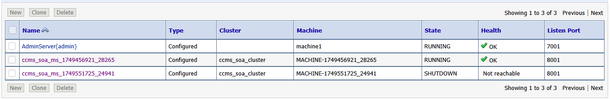

# CCMS-SOA - Known Issues

## A Newly Launched Managed Server is not registered in Weblogic

In the event that a new managed server has booted correctly (and is showing a stable healthcheck on it's EC2 Loadbalancer) but is not properly registering in Weblogic as shown below, this is likley an issue with caching in the Admin server:



To resolve:

- Scale down the Admin Server tasks to `0` in the ECS console.
- Start a new SSM session on the Admin Server EC2 host.
- Execute `sudo docker container ls` and wait for the admin container to stop running
- Once the container has stopped run:

```bash
sudo su ec2-user
cd ~/efs/domains/soainfra/servers
rm -r domain_bak
rm -r AdminServer/cache
rm -r AdminServer/logs
rm -r AdminServer/tmp
```

Exit the terminal and scale the Admin Server back up to `1` instance. Once booted, all Managed Servers should be registered in Weblogic.

## ALARM: ccms-soa-managed-custom-checks-jdbc-ebssms-state

**Log group:** `ccms-soa-managed-ecs`

### What happened (2026-04-16 ~06:01 UTC)

The `ccms-soa-managed-custom-checks-jdbc-ebssms-state` alarm fired due to the EBSSMS JDBC datasource (which connects to the CWA database) entering a `Suspended` state across the managed servers at ~06:03–06:06 UTC.

**Root cause sequence:**

1. **Prior to 05:55 UTC** — The CWA database (`cwa-db`) was unreachable for a sustained period. The `failedReserveRequestCount` for the EBSSMS datasource had accumulated to 126–207 per managed server by 05:55 UTC, indicating the connection pool had been exhausted for some time before the alarm window.

2. **~05:59 UTC** — The managed servers recycled all connection pools (BEA-001128 → BEA-000628 seen for `SOADataSource`, `EssInternalDS`, `mds-*`, `SOALocalTxDataSource`). The EBS connection pool (`eis/DB/EBS`) was successfully recreated — the EBS database was not affected.

3. **06:03–06:06 UTC** — The EBSSMS datasource transitioned to `Suspended` state as the connection pool exhaustion was recognised by WebLogic.

4. **Self-recovery** — The EBSSMS datasource recovered automatically after the managed server connection pool recycling completed. No manual intervention was required.

**Other log entries observed (not related to this alarm):**

- `BEA-002917` (ESSRAWM/ESSAPP work manager cancellations) — normal ESS scheduler cycling behaviour, not a fault.
- HTTP 413 Payload Too Large on `TransientDocumentService` — a separate unrelated issue.

### Summary

The alarm was caused by a transient loss of connectivity to the CWA database. The system self-recovered. If this recurs, check CWA database availability and connectivity from the managed server subnet.

---

## ERROR: RCU Loading Failed. Check the RCU logs

If during the initial starting of an Admin Server in a fresh environment the Admin Server refuses to start and throws an error along the lines of:

```bash
ERROR: RCU Loading Failed. Check the RCU logs
```

This is likely due to one of two reasons.

1. A compatibility issue between Oracle and RDS. The Oracle [RCU](https://docs.oracle.com/cd/E21764_01/doc.1111/e14259/overview.htm) is configured to execute as part of the startup process of the SOA Admin Server and pre-configures the database ready for use. This will happen by default on a fresh database and can be resolved by a DBA executing the below statement:

```bash
EXECUTE rdsadmin.rdsadmin_util.grant_sys_object( p_obj_name => 'DBA_TABLESPACE_USAGE_METRICS', p_grantee => 'SOAPDB', p_privilege => 'SELECT', p_grant_option => true);
```

2. The build guide was not properly followed and one of the components that the RCU creates was manually created. If the RCU finds that an object it is attempting to create already exists it will exit and cause the application to crash loop. If this has been done, it is probably faster to delete the entire database instance **AND** EFS volume and start again (assuming you are in the early stages of a fresh build).
