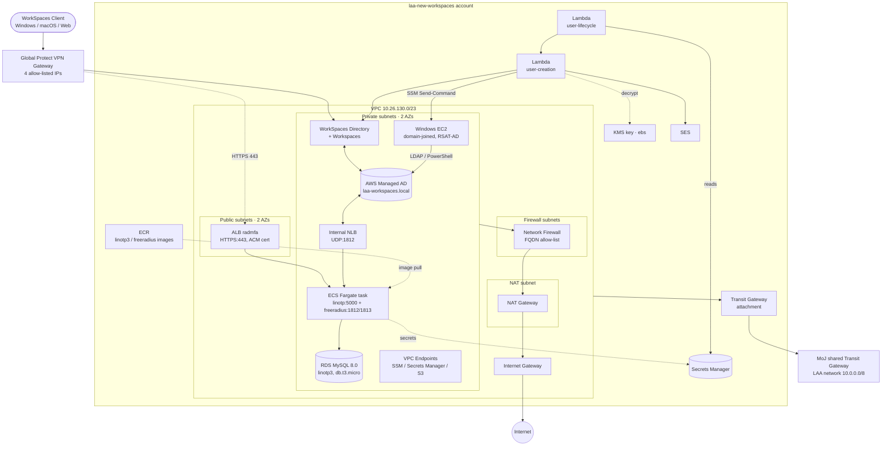

# 1. General Infrastructure

Network topology and the resources sitting in each tier — VPC subnets, the AD
directory, the WorkSpaces fleet, the LinOTP/FreeRADIUS MFA stack, and the
Lambda/EC2 automation that provisions users.

## Key facts

| | |
|---|---|
| **VPC CIDR** | `10.26.130.0/23` (dev) · `10.27.130.0/23` (prod) |
| **WorkSpaces access** | IP group restricted to 4 Global Protect gateway IPs; only Windows, macOS and Web clients allowed |
| **MFA compute** | ECS Fargate, 1024 CPU / 2048 MB — `linotp` :5000 + `freeradius` :1812/1813 UDP |
| **RDS** | MySQL 8.0, db.t3.micro, private-only, SG allows port 3306 from the ECS task SG only |
| **Egress** | private subnets → Network Firewall (FQDN allow-list) → NAT Gateway → IGW |
| **Transit Gateway** | `tgw-053d9dd7f1222a554` — dev routes `10.0.0.0/8` to the wider LAA network |

[← Back to index](README.md) · [Next: Data Flow →](02-data-flow.md)
