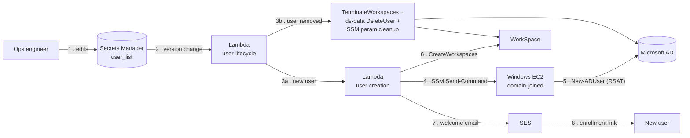
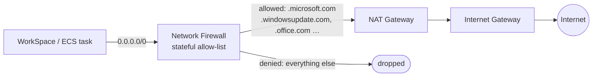

# 2. Data Flow

How a user account and WorkSpace actually get created (and torn down), and how
outbound traffic from WorkSpaces is filtered before it reaches the internet.

## Provisioning & deprovisioning

## Outbound web filtering

## Key facts

| | |
|---|---|
| **Trigger** | EventBridge fires on a new version of the `user_list` secret |
| **Why an EC2 hop** | AD user creation runs as a PowerShell/RSAT script over SSM on a domain-joined Windows box — the Directory Service Data API alone can't set passwords |
| **Guardrail** | `ALLOW_MASS_DELETE=false` on user-lifecycle to prevent a bad secret edit from bulk-deleting users |
| **Egress allow-list covers** | AWS service endpoints, Windows Update/Defender, Microsoft 365 / Azure AD domains only |

[← General Infrastructure](01-general-infrastructure.md) · [Back to index](README.md) · [Next: Authentication →](03-authentication.md)
