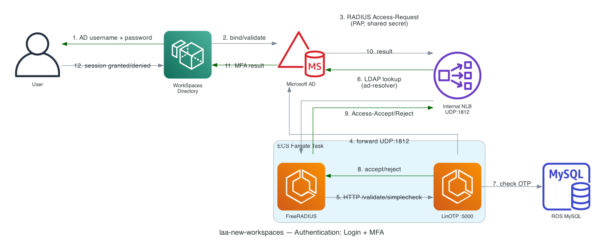
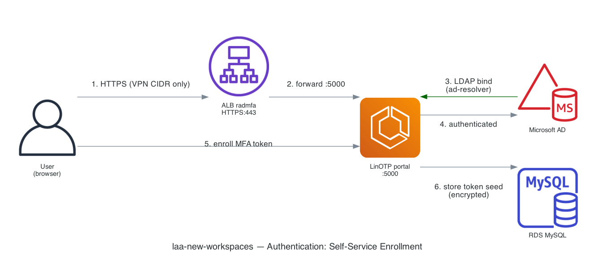

# 3. Authentication (AWS icon set)

Two flows: a WorkSpaces login with RADIUS-backed MFA, and the self-service
portal a user visits once to enroll their MFA token. Numbered arrows show the
order requests travel in.

## WorkSpaces login + MFA challenge

## Self-service MFA enrollment

## Key facts

| | |
|---|---|
| **Primary auth** | AD username/password, validated by the WorkSpaces Directory against `laa-workspaces.local` |
| **MFA transport** | RADIUS PAP over UDP 1812, shared secret held in Secrets Manager, 3 retries / 5s timeout |
| **Portal access control** | ALB only accepts 443/80 from the Global Protect Alpha VPN CIDR range — not open to the internet |
| **NLB health check quirk** | NLB can't health-check UDP directly, so it polls LinOTP's HTTP port 5000 instead |

[← Data Flow](02-data-flow.md) · [Back to index](README.md)
