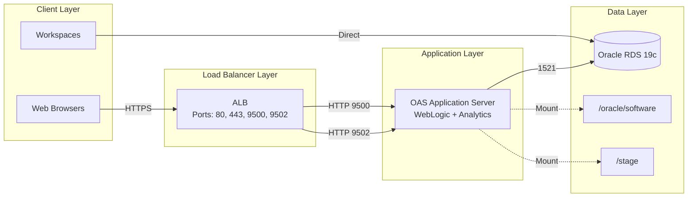

# OAS Component Flow Diagram

**Version:** 1.0  
**Last Updated:** 23 April 2026  
**Related Documentation:** [OAS-Infrastructure-Documentation.md](OAS-Infrastructure-Documentation.md)

---

## Overview

This diagram illustrates the data flow between different layers of the OAS application stack, showing how end-user traffic and administrative connections traverse the infrastructure components.

---

## Component Flow Diagram

---

## Layer Descriptions

### Client Layer
**Web Browsers**
- End users accessing OAS applications
- Traffic originates from corporate networks
- Uses HTTPS (port 443) for secure communication
- Routes through Application Load Balancer

**Workspaces (LZ)**
- Developer workstations in Landing Zone environments
- Direct database connectivity for SQL Developer and other tools
- Connects to RDS on port 1521 (Oracle TNS)
- Bypasses application layer for administrative tasks

### Load Balancer Layer
**Application Load Balancer (ALB)**
- Entry point for all web traffic
- Handles SSL/TLS termination
- Forwards to application servers on:
  - **Port 9500:** OAS Console and Enterprise Manager
  - **Port 9502:** Oracle BI Analytics
- Health checks ensure application availability
- Logs access patterns to S3 buckets

### Application Layer
**OAS Application Server**
- Runs WebLogic Server for Java applications
- Hosts Oracle BI Analytics for reporting
- Deployed on EC2 r5a.large instance
- Oracle Linux 8.10 operating system
- Processes business logic and presentation tier

**Dependencies:**
- Connects to RDS for data persistence
- Mounts EBS volumes for software and staging
- Retrieves secrets from AWS Secrets Manager
- Logs to CloudWatch for monitoring

### Data Layer
**Oracle RDS 19c**
- Relational database for persistent storage
- Multi-AZ deployment for high availability
- Automated backups and snapshots
- Encrypted at rest using AWS KMS

**EBS Volumes**
- **/oracle/software (300GB gp3):** Oracle binaries and installation files
- **/stage (300GB gp3):** Temporary storage for data processing and uploads
- Both volumes encrypted with KMS
- Attached to EC2 application instance

---

## Traffic Flow Details

### User Request Flow
1. **User initiates request** from web browser (HTTPS port 443)
2. **ALB receives request**, terminates SSL, performs routing
3. **ALB forwards** to EC2 on HTTP port 9500 or 9502 based on target group
4. **Application processes request**, may query database
5. **Database query** sent to RDS on port 1521 if needed
6. **Response flows back** through same path to user

### Database Access Flow
**From Application:**
- Application uses JDBC connection pool
- Connects to RDS endpoint on port 1521
- Uses credentials from Secrets Manager
- Connection encrypted with Oracle Native Encryption

**From Workspaces:**
- Direct connection bypassing application layer
- SQL Developer or SQLPlus client tools
- Security group allows traffic from LZ CIDR ranges
- Used for database administration and development

### Storage Access Flow
**EBS Volume Mounting:**
- Volumes attached to EC2 at launch via Terraform
- Userdata script detects and mounts volumes
- Largest volume → /oracle/software
- Second largest → /stage
- Persistent across instance reboots

---

## Port Summary

| **Source** | **Destination** | **Port** | **Protocol** | **Purpose** |
|------------|----------------|----------|--------------|-------------|
| Web Browsers | ALB | 443 | HTTPS | User access to OAS applications |
| ALB | EC2 | 9500 | HTTP | OAS Console / Enterprise Manager |
| ALB | EC2 | 9502 | HTTP | Oracle BI Analytics |
| EC2 | RDS | 1521 | TCP | Oracle database connectivity |
| Workspaces | RDS | 1521 | TCP | Direct database access (SQL Developer) |
| Bastion | EC2 | 22 | SSH | Administrative SSH access |

---

## Data Flow Patterns

### Read Operations
- User queries flow through ALB → Application → RDS
- Application reads from /oracle/software for binary execution
- Application reads from /stage for temporary file processing
- Workspaces read directly from RDS for reporting

### Write Operations
- Application writes to RDS for data persistence
- Application writes to /stage for temporary data
- Logs written to CloudWatch via CloudWatch agent
- ALB access logs written to S3

### Backup Flow
- RDS automated backups to AWS-managed storage
- EBS snapshots triggered by Data Lifecycle Manager
- Manual snapshots before major changes
- Cross-region copy for disaster recovery (if configured)

---

## How to Use This Diagram

### View in VS Code
1. Install extension: `Markdown Preview Mermaid Support`
2. Open this file in VS Code
3. Press `Cmd+Shift+V` (Mac) or `Ctrl+Shift+V` (Windows/Linux)
4. Diagram will render in preview pane

### Export as Image
1. Visit https://mermaid.live
2. Copy the entire Mermaid code block above
3. Paste into the Mermaid Live Editor
4. Click "Export" button
5. Choose PNG (for presentations) or SVG (for documents)
6. Download your high-resolution diagram

### View in GitHub/GitLab
- Simply navigate to this file in your repository
- Mermaid syntax renders automatically
- No additional tools required

### Embed in Confluence
1. Install "Mermaid Diagrams for Confluence" plugin (if not already installed)
2. Add a Mermaid macro to your Confluence page
3. Paste the Mermaid code into the macro
4. Save the page to render the diagram

---

## Diagram Updates

When infrastructure or flow changes occur:

1. **Identify Flow Changes:** Determine which connections are added or modified
2. **Update Mermaid Code:** Edit the diagram code in this file
3. **Update Port Table:** Sync the port summary table with any new connections
4. **Test Rendering:** Preview in VS Code or Mermaid Live
5. **Update Documentation:** Sync with [OAS-Infrastructure-Documentation.md](OAS-Infrastructure-Documentation.md)
6. **Update Index:** Update [OAS-Infrastructure-Diagrams.md](OAS-Infrastructure-Diagrams.md)
7. **Commit Changes:** Use descriptive commit message

---

## Related Diagrams

- [High-Level Architecture Diagram](OAS-Diagram-High-Level-Architecture.md) - Complete infrastructure overview
- [All Diagrams Index](OAS-Infrastructure-Diagrams.md) - Complete diagram collection

---

## Additional Flow Diagrams to Consider

### Security Flow Diagram
- Show security group rules in detail
- IAM role assumptions and policy evaluations
- Encryption points and key management

### Deployment Flow Diagram
- Terraform execution flow
- Resource creation order and dependencies
- Approval and validation gates

### Monitoring Flow Diagram
- Metric collection and aggregation
- Log flow from sources to CloudWatch
- Alarm evaluation and notification paths

---

**Document Owner:** OAS DevOps Team  
**Review Frequency:** Quarterly or when infrastructure changes  
**Next Review Date:** July 2026

---

**End of Diagram**
