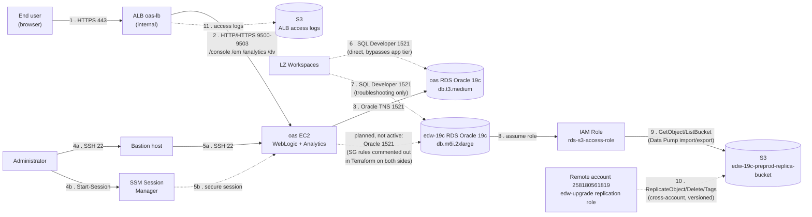
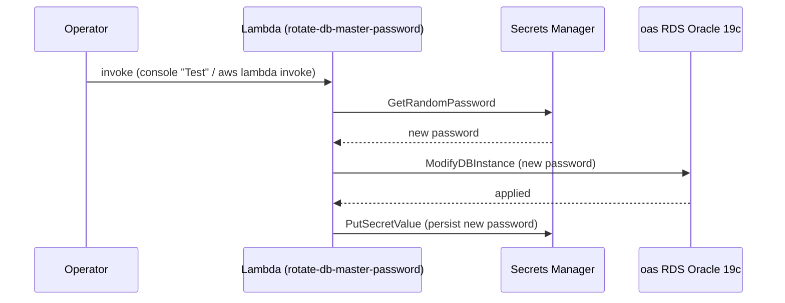
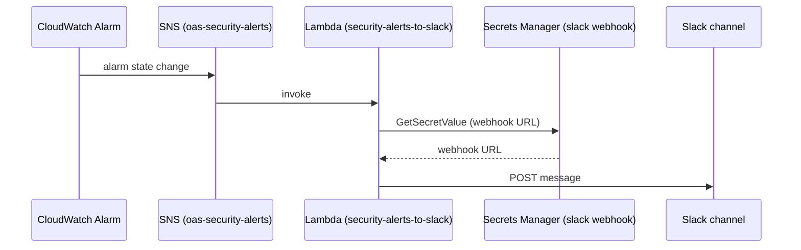

# 0. Combined Data Flow — oas + edw-19c

How traffic and credentials move through both apps: end-user/admin/database access,
edw-19c's S3 Data Pump and cross-account replication, and the two OAS-only automation
paths. edw-19c has no compute tier and no automation of its own, so it only appears in
the access-patterns flowchart below.

## Access patterns

## Automation: RDS master password rotation (oas only)

Manually invoked (`oas/new_lambda_rotate_db_password.tf`) — not wired to Secrets
Manager's automatic rotation schedule, so there's no EventBridge rule or fixed cadence.
edw-19c has no equivalent — its master password is generated once at creation and never
rotated by automation.

## Automation: CloudWatch → Slack security alerting (oas only)

edw-19c has no CloudWatch alarms or SNS topic wired up — this alerting path is oas-only.

## Key facts

| | |
|---|---|
| **oas↔edw-19c direct link** | Declared in Terraform on both sides but commented out — not active traffic today, shown as the dashed red edge above |
| **Only shared consumer** | LZ Workspaces, which connects independently to each RDS instance over SQL Developer 1521 |
| **edw-19c automation** | None — no Lambdas, no CloudWatch alarms, no SNS topic; it's a passive RDS-only workload |
| **Direct DB access** | LZ Workspaces reach both RDS instances without going through any app tier |
| **Admin access (oas)** | Bastion (SSH) or SSM Session Manager only — edw-19c has no compute to administer |
| **Password rotation** | oas: manual Lambda invoke only. edw-19c: generated once, never rotated |

[← Back to index](README.md) · [See also: Combined General Infrastructure →](00-combined-general-infrastructure.md)
