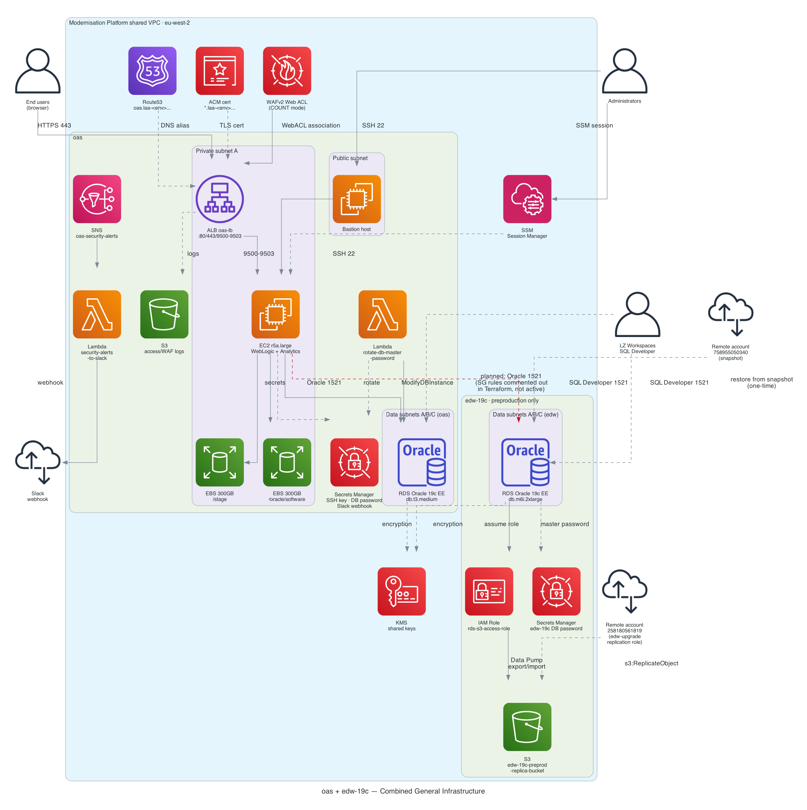

# 0. Combined General Infrastructure — oas + edw-19c

A single view of both apps in the shared Modernisation Platform VPC. `oas` is the
WebLogic/Analytics application tier; `edw-19c` is a standalone Oracle RDS instance with
no compute tier of its own. They're drawn together here because they sit in the same
VPC, share the account/network conventions, and have a **declared-but-currently-inactive**
direct connection between them.

## How to read this diagram

- **Left/centre (`oas` cluster):** ALB → EC2 → RDS application tier, plus bastion, WAF,
  ACM, Route53, Secrets Manager, S3 logging, and the two automation Lambdas. Full detail
  in the [oas-only diagram](01-general-infrastructure.md).
- **Right (`edw-19c` cluster):** the standalone RDS instance, its `S3_INTEGRATION` IAM
  role, the cross-account replication bucket, and its own Secrets Manager entry. Full
  detail in the [edw-19c-only diagram](../../../edw-19c/infra_docs_and_diagramms/aws-icons/01-general-infrastructure.md).
- **Red dashed edge (`oas` EC2 → `edw-19c` RDS):** `oas/new-ec2-sg.tf` and
  `edw-19c/rds-sg.tf` both contain commented-out security group rules
  (`ingress_rds_from_mp_vpc_for_edw` / `egress_rds_to_mp_vpc_for_edw` on the oas side,
  `ingress_rds_from_oas` / `rds_sg_egress_oas` on the edw side) for Oracle 1521 between
  the two. **This connectivity is not currently enabled** — it's shown because it's
  explicitly declared in Terraform (just disabled), not because traffic actually flows.
- **LZ Workspaces** connects directly to both RDS instances independently — there is no
  data path between the two databases today other than that dormant SG rule pair.

## Key facts

| | |
|---|---|
| **Shared VPC** | Both apps sit in the same Modernisation Platform shared VPC, `eu-west-2` |
| **Only real link today** | None — the OAS↔EDW security group rules exist in Terraform but are commented out on both sides |
| **oas compute** | EC2 r5a.large (WebLogic + Analytics), ALB, bastion |
| **edw-19c compute** | None — RDS-only, `preproduction` environment only |
| **Both use** | Oracle 19c EE RDS, KMS encryption, Secrets Manager for master passwords, LZ Workspaces SQL Developer access on 1521 |
| **oas-only** | ALB/WAF/ACM/Route53, EBS volumes, password-rotation Lambda, Slack security alerting |
| **edw-19c-only** | S3 `S3_INTEGRATION` Data Pump path, cross-account S3 replication from a separate migration account |

[← Back to index](README.md) · [See also: Combined Data Flow →](00-combined-data-flow.md)
