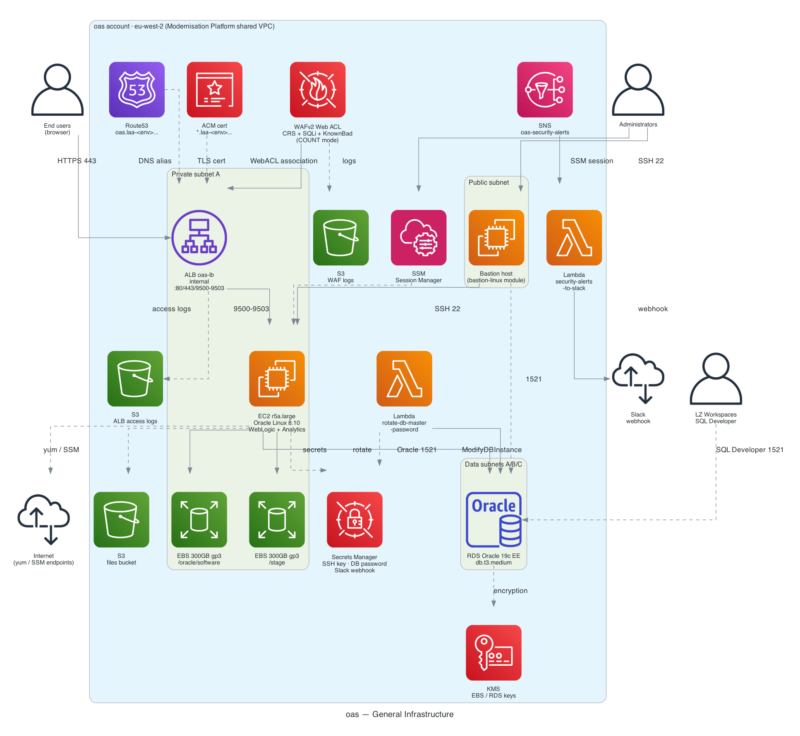

# 1. General Infrastructure

Network topology and the resources sitting in each tier — the Oracle Application
Server EC2 instance, the internal ALB, the Oracle RDS database, and the supporting
security/automation services.

## Key facts

| | |
|---|---|
| **VPC** | Shared Modernisation Platform VPC (`10.26.0.0/16` dev · `10.27.0.0/16` preprod) |
| **Compute** | EC2 r5a.large, Oracle Linux 8.10, WebLogic + Analytics/DV, private subnet A only |
| **Storage** | 2x 300GB gp3 EBS volumes (`/oracle/software`, `/stage`), both KMS-encrypted |
| **RDS** | Oracle 19c Enterprise Edition, db.t3.medium, data subnets A/B/C, BYOL |
| **Load balancer** | Internal ALB, listeners on 80 (redirect)/443/9500/9501/9502/9503, WAFv2 in COUNT mode |
| **Ingress** | Restricted to MOJ/Workspace CIDRs (`loadbalancer_ingress_rules` in `new-alb.tf`) |
| **Admin access** | Bastion host (SSH) or SSM Session Manager — no other inbound to the EC2 SG |
| **DB access** | App tier over Oracle TNS 1521; LZ Workspaces connect directly via SQL Developer |
| **Secrets** | EC2 SSH key, RDS master password, Slack webhook — all in Secrets Manager |
| **Logging** | ALB access logs and WAF logs to separate S3 buckets, both KMS/SSE encrypted |

[← Back to index](README.md) · [Next: Data Flow →](02-data-flow.md)
