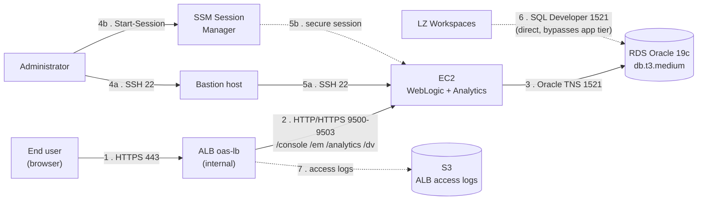
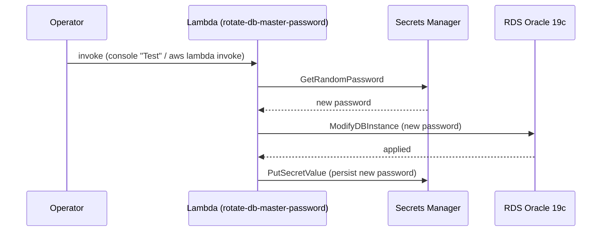
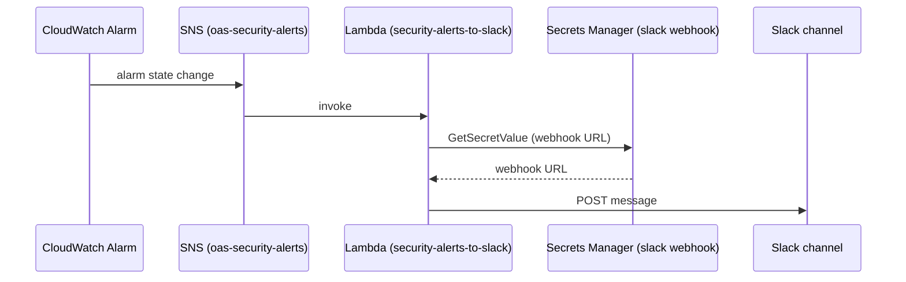

# 2. Data Flow

How traffic and credentials move through the estate: end-user/admin/database access
patterns, and the two automation paths (manual DB password rotation, CloudWatch → Slack
security alerting).

## Access patterns

## Automation: RDS master password rotation

Manually invoked (`new_lambda_rotate_db_password.tf`) — not wired to Secrets Manager's
automatic rotation schedule, so there's no EventBridge rule or fixed cadence.

## Automation: CloudWatch → Slack security alerting

## Key facts

| | |
|---|---|
| **Console/EM ports** | 9500 (HTTP) / 9501 (HTTPS) |
| **Analytics/DV ports** | 9502 (HTTP) / 9503 (HTTPS) |
| **Direct DB access** | LZ Workspaces reach RDS on 1521 without going through the ALB or EC2 — allowed by a dedicated RDS security group rule for the management CIDR |
| **Admin access** | Bastion (SSH) or SSM Session Manager only — no other inbound to the EC2 security group |
| **Password rotation trigger** | Manual only — no schedule, no automatic Secrets Manager rotation |
| **Alerting path** | CloudWatch Alarm → SNS → Lambda → Slack webhook (URL stored in Secrets Manager) |

[← General Infrastructure](01-general-infrastructure.md) · [Back to index](README.md)
